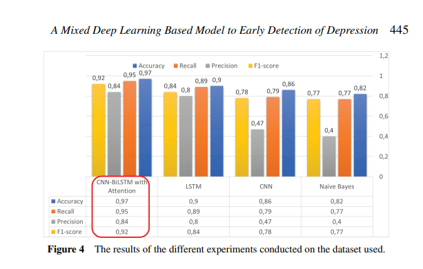

### 🫠 Paper Name :

- A Mixed Deep Learning Based Model to Early Detection of Depression

### 🚨 Personal Review :

- Good Paper

### 👏 Author Background :

- Faculty of Computing, Universiti Teknologi Malaysia,

### 🤷 Domain :

- Message-level Sentiment Analysis
- Convolutional Neural Networks
- Deep Learning
- Depression Identification
- Early Risk Detection

### 🙏 Abstract Summary :

- A new deep learning model that trained on adepression-dedicated dataset in order to detect such mental illness from an individual’s posts.
- Trained custom word embeddings using a depression-dedicated dataset.
- Integrated a Convolutional Neural Networks model with the Message-level Sentiment Analysis model to enhance feature extraction and model performance.
- Conducted experiments with three deep learning models to provide insights for depression research, deploying four classifier models with the same dataset.

### 🏆 Achievement or Claimed :

- Accuracy, Recall, Precision and F1 macro scores of 0.97, 0.95, 0.84 and 0.92, respectively, were achieved by the proposed model.

### 🎯 Technique Used 👍:

- Depression Detection Model Architecture ( 4 Layer)
  - Preprocessing Layer
    - Cleaning
    - Tokenization
  - Word Embedding Layer
    - The Skip-gram model’s word embeddings
  - Learning Layer ( 4 Models)
    - Model 1-Naive Bayes classifier,
    - Model 2-CNN model,
    - Model 3-LSTM model,
    - Model 4-CNN-BiLSTM with attention model
  - Softmax Layer

### 📚 Dataset:

- Using eRisk 2018 dataset that indicates early identification of signs of depression
- The dataset involves a total of 887 subjects. Of these, 135 are facing depression. The dataset comprises over 500,000 different comments and posts, with an average of around 600 posts for every subject

### 🫣 Compare with Other Work :

