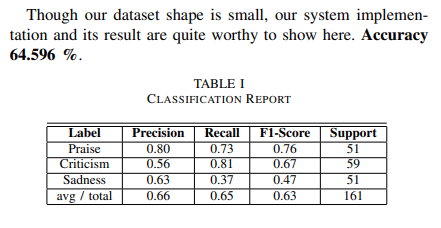
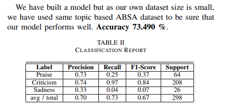
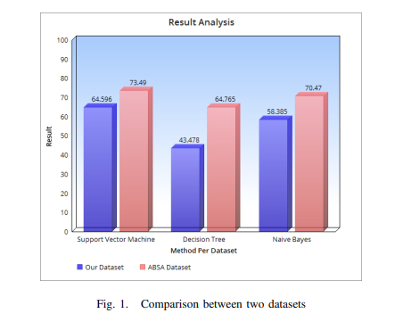

### 🫠 Paper Name :

- Sentiment Analysis on Bangladesh Cricket with Support Vector Machine

### 🚨 Personal Review :
- Average

### 👏 Author Background :

- Department of CSE, SUST

### 🤷 Domain :

- Sentiment Analysis
- Support Vector Machine

### 🙏 Abstract Summary :

- Performaning Sentiment Analysis on people opinion(Bengali Native Language) in Bangladesh Cricket
- Prepared a dataset of three sentiment classes about Bangladesh Cricket
- Used TF-IDF Vectorizer for vectorization and the classifier Support Vector Machine to classify data

### 🏆 Achievement or Claimed :
- Own Personalization Dataset
- Personal Dataset Accuracy : 64.596%
- ABSA Dataset Accuracy : 73.490%

### 🎯 Technique Used 👍:

- Preprocessing for Bengali text data is performed using : Python Natural Language Toolkitc
- Vectorization and classification using machine learning model : scikit-learn

### 📚 Dataset:
- Bengali dataset ABSA contains 2979 data with 5 columns
- Personalized Dataset : Dataset is 1601 which contains 3 classes including praise with 513, criticism with 604 and sadness with 484 labeled data

### 😡 Limitation (Future Work) :

- Increase Dataset for more accuracy
- Increase Target Classes and Improve Approaches
-  Bengali language where have not done the stemming, spell-checking and Bengali parts-of-speech tagging for current research.
- Proper Use of Natural Language Processing

### 🫣 Compare with Other Work :

### 🔙 Background :

- Proposed the work where they utilizes the naive Bayes and fuzzy classifier to classify tweets into positive, negative or neutral behavior of a particular person
- In [12], they consider the problem of classifying documents not by topic but by overall sentiment determining whether a reviewis positive or negative.
- In [8], they have done their sentiment analysis in detecting insults and flames. This inspired us to choose and work on our class criticism in Bangladesh Cricket in our dataset
- Bengali language on Twitterdata to find the polarity of a Bengali text if it is positive or negative

