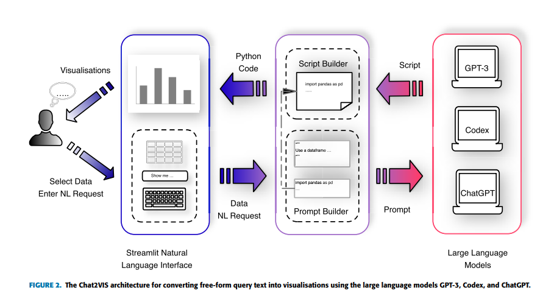

### 🫠 Paper Name :

- Chat2VIS: Generating Data Visualizations via Natural Language Using ChatGPT, Codex and GPT-3 Large Language Models

### 🚨 Personal Review :
- Good Paper

### 👏 Author Background :

- School of Mathematical and Computational Sciences, Massey University

### 🤷 Domain :

- ChatGPT . CodeX . GPT-3 .
- Large Language Models .
- End to End Visualisation Generation from Natural Language
- Text to Visualisation
- Data Visualisation

### 🙏 Abstract Summary :

- The paper proposes a novel system, Chat2VIS, which leverages the capabilities of large language models (LLMs) such as ChatGPT, Codex, and GPT-3 to convert free-form natural language queries into code for appropriate visualizations.
- The paper demonstrates how, with effective prompt engineering, the complex problem of language understanding and code generation can be solved more efficiently and accurately than prior approaches that use hand-crafted grammar rules and tailored models.
- Chat2VIS shows that LLMs together with the proposed prompts offer a reliable approach to rendering visualisations from natural language queries, even when queries are highly misspecified and underspecified

### 🏆 Achievement or Claimed :

- The Chat2VIS architecture for converting free-form query text into visualisations using the large language models GPT-3, Codex, and ChatGPT
- Chat2VIS leverages the state-of-the-art LLMs ChatGPT, GPT-3, and Codex, which can understand user requests and generate code for appropriate visualizations.
- Chat2VIS is efficient, reliable, and accurate due to the use of pre-trained LLMs and well-engineered prompts.
- Chat2VIS can automatically select the best chart type for the query, even if it is vague or malformed.
- Chat2VIS ensures data privacy and security by using LLM prompts that do not expose sensitive information.

### 🎯 Technique Used 👍:

- NATURAL LANGUAGE INTERFACE
- PROMPT ENGINEERING
- SCRIPT REFINEMENT AND RENDERING
- Chat2VIS EVALUATION

### 📚 Dataset:

### 😡 Limitation (Future Work) :

- Setting the plot background Color Unsuccessful
- Fails to display the plot grid line successfully
- More issue on specifying coloring of plot and elements ,variability in plot generation
- The paper only evaluated the Chat2VIS system on a limited number of case studies and datasets, and did not include end-user feedback or qualitative assessment of the system’s usefulness and usability.
- The paper did not compare the performance of Chat2VIS with other state-of-the-art NL2VIS systems that use neural machine translation methods, such as ncNet, RGVisNet, and YoloPandas.
- The paper did not investigate the ethical and social implications of using LLMs for NL2VIS, such as the potential for generating misleading or biased visualisations, or the privacy and security risks of sending user data and queries to external APIs.

### 🫣 Compare with Other Work :

### 🔙 Background :

### 🤔 Summary :
