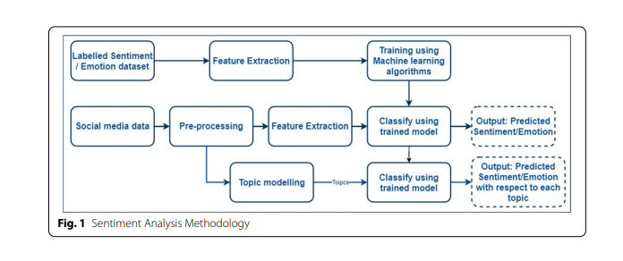
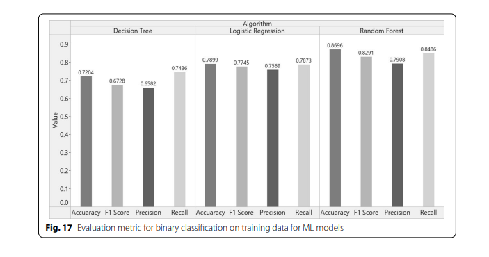
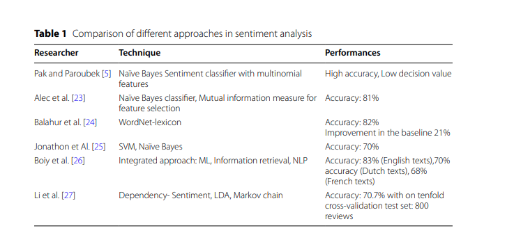

### 🫠 Paper Name :

- Stress Detection using Natural Language Processing and Machine Learning over social media interactions

### 🚨 Personal Review :

- Good Paper

### 👏 Author Background :

- Departments of ICT, Manipal Institute of Technology, Karnataka, India

### 🤷 Domain :

- Machine Learning ( Decision Tree , Logistic Regression, Random Forest Classifier)
- Natural Language Processing (BERT, Latent Dirichlet Allocation)
- Sentiment Analysis
- Topic Modeling

### 🙏 Abstract Summary :

- The paper aims to detect the stress level of individuals based on their social media posts and comments, using sentiment and emotion analysis techniques.
- The paper uses machine learning algorithms and a deep learning model called BERT to perform sentiment classification and emotion detection on a large-scale dataset of tweets.
- The paper also uses Latent Dirichlet Allocation (Unsupervised machine learning) to perform topic modeling on the tweets, which helps to identify the topics related to the textual data.
- The paper claims that the proposed models have a high accuracy and are useful for mental health monitoring. The paper evaluates the models using various metrics at the macro and micro levels while indicates that e trained model detects the status of emotions based on social interactions

### 🏆 Achievement or Claimed :

- Binary classifcation of the sentiments behind the tweets
- Perform topic modeling with the help of LDA which takes into consideration the density of every topic and calculates a topic structure through an iteration process.
- Emotion classifcation using deep learning-based BERT model to detect stress.
- Develop a Django-based web application that receives inputs from a user and then accordingly generates a prediction.
- Develop a system in the form of a web portal that not only detects stress but also analyses the topic of discussion in a particular tweet.
- Accurately analyze and segregate the user’s opinions on diferent topics
- The model has a macro average accuracy of 94%, and a macro F1-score of 83%.
- Random Forest Classifier is a better algorithm than Logistic Regression and Decision Trees with an accuracy of 97.78%

### 🎯 Technique Used 👍:

### 📚 Dataset:

- Large Twitter datasets (100042 tweets)

### 😡 Limitation (Future Work) :

- Develop a system that can detect stress and analyze the topic of discussion in tweets, especially on policy opinionated content such as politics and news12.
- Analyze if a tweet is spam or non-spam and filter out the harmful or damaging ones from the platform3.
- Improve the sentiment word identification algorithm to handle abbreviations, slang, jargon, and bi-polar sentiments and create a high content lexicon database.
  -Implement a dynamic topic model that can examine the changes of topics over time and incorporate time-varying information4.

### 🫣 Compare with Other Work :

### 🔙 Background :

- Agarwal et al. [11] proposed a 3-way model for categorizing sentiments in three classes. The classes were positive, negative, and neutral.
- Davidov et al. [13] projected a method to utilize Twitter user-defned hashtags in tweets as a classifcation of sentiment type using punctuation, single words, and patterns as disparate feature types.

### 🤔 Summary :

- In summary, the paper proposes a comprehensive approach utilizing machine learning and deep learning techniques to analyze sentiment and emotion in social media data, with the ultimate goal of identifying and addressing stress and depression indicators in individuals.
