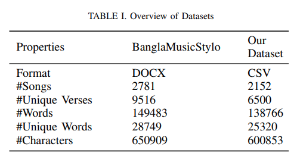

### 🫠 Paper Name :

- Verse-Based Emotion Analysis of Bengali Music from Lyrics Using Machine Learning and Neural Network Classifiers

### 🚨 Personal Review :

- Average Paper

### 👏 Author Background :

- Maraz Mia, Pulock Das and Ahsan Habib

### 🤷 Domain :

- Natural Language Processing
- Sentiment Analysis
- Machine Learning
- Neural Network

### 🙏 Abstract Summary :

- Introduced a verse-based emotion analysis system for Bengali songs that is able to identify certain emotions from textual data.

### 🏆 Achievement or Claimed :

- Achieved the best accuracy of 80% and 65% using the Bidirectional Encoder Representations from Transformers (BERT) model for both three and two emotion classes.

- Building a dataset that contains verse-wise emotions for Bengali songs
- Introducing multi-class classification approach in Bengali song’s sentiment analysis,
- Applying and evaluating different ML and NN models on our dataset,
- Integrating a UI in a local environment to visually illustrate the classification scheme

### 🎯 Technique Used 👍:

- Dataset Preparation and Preprocessing
- Verse Based Approach
- Multi-Class Emotion Classification
- Dataset Labeling with Emotion Tags (Love, Sad, Idealistic)
- Data Cleanup
- Freature Extraction
- Model Selection
- User Interface

### 📚 Dataset:

### 😡 Limitation :

- Some models did not perform well on the dataset
- 3-class classification the Sad and Idealistic emotions were not particularly recognized well enough
- Noisy Dataset
- Limited Emotion Classes
- Moderate Accuracy in ternary Classification

### 🫣 Future Work :

- Expand dataset with diverse textual features
- Increase emotion classes for enhanced classification
- Develop hybrid mood classification using audio and lyric data
- Implement explainable AI for trustworthy predictions
- Enhance realism through multi-level categorization in lyric mood classification
